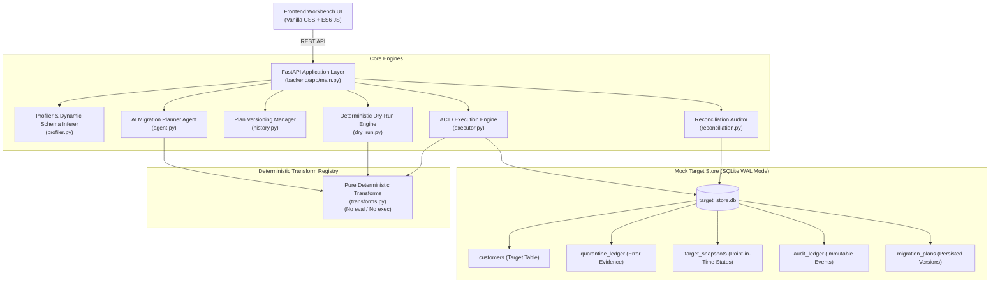

# Agentic Data Migration Planner and Reconciliation Workbench

[](https://www.python.org/downloads/)
[](https://fastapi.tiangolo.com)
[](https://docs.pydantic.dev/)
[]()
[](LICENSE)

An enterprise-grade, deterministic **Agentic Data Migration Planner and Reconciliation Workbench** built to eliminate silent data loss during schema migrations. 

The application enables data engineering teams to safely ingest, profile, plan, dry-run simulate, quarantine, execute, and mathematically reconcile legacy dataset migrations into strict modern target schemas with a human-in-the-loop governance barrier and 1-click snapshot rollback.

> 📋 **Comprehensive Architecture & Review Evaluation Document**: See [REVIEW_AND_EVALUATION.md](REVIEW_AND_EVALUATION.md) for a breakdown mapped to the 10 professional review rubric criteria.
> 🚀 **Render 1-Click Deployment**: See [render.yaml](render.yaml) for automated Blueprint deployment.

---

## Table of Contents
1. [Key Features](#key-features)
2. [System Architecture](#system-architecture)
3. [Setup & Quick Start](#setup--quick-start)
4. [Completed vs. Excluded Scope](#completed-vs-excluded-scope)
5. [End-to-End Workflow](#end-to-end-workflow)
6. [Testing & Verification](#testing--verification)
7. [System Limitations](#system-limitations)
8. [Production Deployment Details](#production-deployment-details)

---

## Key Features

- **Automated AI Schema Planner**: Profiles legacy fields, infers dynamic column types, matches target fields semantically, assigns pure deterministic transforms, and flags risk levels (`LOW`, `MEDIUM`, `HIGH`).
- **Interactive Ambiguity Clarification**: Generates targeted business questions for ambiguous edge cases (e.g. legacy codes, empty names) before plan approval.
- **Plan Versioning & Audit Machine**: Formal plan lifecycle (`DRAFT` $\rightarrow$ `PROPOSED` $\rightarrow$ `APPROVED` $\rightarrow$ `EXECUTED` $\rightarrow$ `ROLLED_BACK`) backed by a persistent SQLite ledger.
- **Deterministic In-Memory Dry Run**: Simulates 100% of transformations with **zero database writes**, partitioning records into valid rows vs. quarantined records.
- **Granular Quarantine Ledger**: Preserves the row index, natural key, raw payload, and exact rule violation evidence (e.g. `[email]: Invalid RFC email format`) without silently dropping data.
- **Human Gatekeeper Barrier**: Enforces a strict cryptographic sign-off requirement; execution attempts without prior human approval raise `HTTP 400`.
- **ACID Execution & Pre-Run Snapshots**: Executes batch migrations inside a SQLite transaction running in Write-Ahead Logging (WAL) mode with automated point-in-time state snapshots.
- **Idempotent Retry & Deduplication**: Prevents duplicate insertions across retried or repeated runs by matching natural keys and updating audit metadata.
- **Mass Conservation Reconciliation**: Mathematically verifies zero data loss using the parity invariant:
  $$\text{Source Records} = \text{Target Records} + \text{Quarantine Ledger} + \text{Duplicates}$$
- **1-Click Snapshot Rollback**: Reverts the target database to the exact pre-migration snapshot state in milliseconds.
- **Universal Data Intake & Downstream Export**: Supports arbitrary user file uploads (`.csv`, `.xlsx`, `.json`) and 1-click exports of clean target records and quarantine ledgers.

---

## System Architecture



### Module Responsibilities

| File | Purpose |
| :--- | :--- |
| `backend/app/main.py` | FastAPI server exposing REST endpoints, static assets, and upload/export controllers. |
| `backend/app/models/schemas.py` | Pydantic v2 schemas defining plans, mappings, transforms, dry-run summaries, and audits. |
| `backend/app/engine/transforms.py` | Registry of 12 pure, deterministic transformation functions with zero arbitrary code execution. |
| `backend/app/engine/profiler.py` | Statistical column profiler and dynamic schema inferer for user-uploaded datasets. |
| `backend/app/engine/agent.py` | AI migration planner implementing semantic heuristics, risk scoring, and ambiguity questions. |
| `backend/app/engine/history.py` | Plan versioning state machine persisted in SQLite. |
| `backend/app/engine/dry_run.py` | Zero-write simulation engine that partitions records into valid vs. quarantine with error proofs. |
| `backend/app/engine/executor.py` | ACID transaction executor, pre-run snapshot creator, idempotency deduplicator, and rollback engine. |
| `backend/app/engine/reconciliation.py` | Mathematical mass conservation auditor ($S = T + Q + D$) and monetary checksum verifier. |
| `backend/app/engine/target_store.py` | SQLite database manager running in WAL mode with connection pooling and schema migrations. |
| `frontend/index.html` & `app.js` | Glassmorphic dark-mode web interface with live data tables, connector charts, and modals. |

---

## Setup & Quick Start

### 1. Prerequisites
- **Python**: Version 3.11 or higher (Python 3.13 tested and verified)
- **Git**

### 2. Clone and Setup Virtual Environment
```bash
# Clone the repository
git clone <repo-url>
cd data_mig

# Create and activate virtual environment
python3 -m venv .venv
source .venv/bin/activate   # On Windows: .venv\Scripts\activate
```

### 3. Install Dependencies
```bash
pip install --upgrade pip
pip install fastapi uvicorn pydantic pytest httpx python-multipart openpyxl
```

### 4. Configure Environment
```bash
cp .env.example .env
```

### 5. Launch the Workbench
```bash
PYTHONPATH=backend uvicorn app.main:app --host 127.0.0.1 --port 8000 --reload
```

Open your browser to:
- **Workbench UI**: [http://127.0.0.1:8000](http://127.0.0.1:8000)
- **Interactive Swagger API Docs**: [http://127.0.0.1:8000/docs](http://127.0.0.1:8000/docs)
- **Alternative ReDoc Docs**: [http://127.0.0.1:8000/redoc](http://127.0.0.1:8000/redoc)

---

## Completed vs. Excluded Scope

In accordance with the specification in `plan.txt`:

### Completed Scope
- **Bounded Dataset Intake**: Out-of-the-box support for a 1,000-record benchmark CRM dataset, plus real Excel (`.xlsx`), CSV, and JSON uploads up to 100,000 records.
- **Pure Transform Registry**: 12 deterministic transformation rules (`DIRECT_COPY`, `TRIM_CLEAN`, `SPLIT_NAME`, `CONCAT_WS`, `DATE_TO_ISO8601`, `PHONE_TO_E164`, `EMAIL_NORMALIZE`, `CLEAN_CURRENCY_TO_FLOAT`, `ENUM_LOOKUP`, `COUNTRY_TO_ISO2`, `COALESCE_VAL`, `UUID_V5_FROM_KEY`).
- **Plan Versioning**: Full versioning lifecycle (`Plan v1`, `Plan v2`, etc.) with actor attribution and timestamps.
- **Deterministic Dry Run**: Complete partition into valid vs. quarantine records with field-level evidence.
- **Mandatory Human Approval**: Cryptographic execution block without prior human sign-off.
- **ACID Transaction Execution**: SQLite in WAL mode with pre-run snapshotting.
- **Idempotency on Retry**: Deduplication matching natural keys to prevent redundant inserts on retries.
- **Mathematical Reconciliation**: Verification of count conservation ($S = T + Q + D$) and monetary checksum parity.
- **1-Click Rollback**: Zero-loss snapshot restoration.
- **Audit Ledger**: Comprehensive immutable event history for all planning, dry-run, approval, and execution actions.

### Excluded Scope (By Design)
- **No Arbitrary Code Execution**: No `eval()` or unvetted Python code strings are executed at runtime for safety.
- **No Live Cloud Connectors**: Direct network connections to live cloud warehouses (e.g. Snowflake, BigQuery) are replaced with the ACID mock target store.
- **No Distributed Engines**: Processing is single-node in-process rather than distributed across Apache Spark/Flink clusters.
- **No Multi-Table Relational Cascades**: Focus is maintained on a single master customer entity migration.

---

## End-to-End Workflow

1. **Intake & Profiling**: User inspects source fields or uploads a custom `.csv` / `.xlsx` spreadsheet.
2. **AI Plan Generation**: The agent evaluates null rates and anomalies, proposing column mappings, deterministic rules, and risk ratings.
3. **Ambiguity Resolution**: User reviews clarification questions (e.g. fallback handling for unknown status codes).
4. **Dry-Run Simulation**: The engine simulates transformations in-memory, partitioning records into 902 valid vs. 98 quarantined rows.
5. **Quarantine Inspection**: User inspects exact error proof (e.g. missing `@` in emails, unparseable date strings) and exports the quarantine CSV for upstream remediation.
6. **Plan Approval**: An authorized engineer reviews the simulation metrics, signs off, and unlocks the execution barrier.
7. **ACID Execution**: Clean records are written to the target database; pre-run snapshot is saved.
8. **Reconciliation Audit**: The system validates mass conservation and parity checksums.
9. **Export / Rollback**: User downloads clean target CSV or triggers 1-click rollback if needed.

---

## Testing & Verification

The repository includes a comprehensive automated test suite spanning unit tests, integration tests, and live server verifications.

### Run All Pytest Tests
```bash
PYTHONPATH=backend pytest backend/tests/ -v
```

### Test Summary (45 Passed, 0 Failed, Complete Hermetic Isolation)
The test suite enforces full test isolation with per-test temporary SQLite databases (`tmp_path`), zero cross-test state pollution, negative test cases, and cryptographic anti-tamper proofs:

| Test Module | Coverage Area | Status |
| :--- | :--- | :--- |
| `test_production_security_and_contracts.py` | SQL injection defense, unmapped NOT NULL enforcement, type coercion, SHA-256 fingerprint tampering defense, Mode 2 durability, persistence error propagation | **10 Passed** |
| `test_migration_pipeline.py` | Mode 1 end-to-end pipeline, approval barriers, dry runs, idempotent retry, snapshot rollback | **4 Passed** |
| `test_v2_dynamic_migration.py` | Mode 2 DDL compilation, dynamic upserts, true rollback undo, LLM config, strict AI isolation | **4 Passed** |
| `test_mode1_strict_1000_records.py` | Strict 1,000 legacy records intake, mass conservation ($S = T + Q + D$), zero leakage | **6 Passed** |
| `test_production_resilience_v2.py` | Multi-format input resilience (JSON, nested JSON, CSV), system logs endpoint, snapshot rollback | **5 Passed** |
| `test_ai_fix_remediation.py` | In-flight AI auto-remediation, single-field and auto-resolve-all, plan invalidation | **3 Passed** |
| `test_transforms.py` | Pure deterministic transformations (split name, date ISO, phone E.164, currency, UUID v5) | **7 Passed** |
| `test_api.py` | Core FastAPI route contracts, schema endpoints, clarification questions | **5 Passed** |
| `test_custom_dataset.py` | User custom CSV upload, dynamic schema inference, and execution | **1 Passed** |
| **Total** | **Comprehensive Regression & Security Suite** | **45 Passed** |

```bash
================= 45 passed, 1 deselected, 1 warning in 39.83s =================
```

### Run Live Server E2E Verification
To verify the active running server at `http://127.0.0.1:8000`:
```bash
PYTHONPATH=backend python3 backend/tests/verify_e2e_live.py
```
This script exercises all 12 critical workbench stages: schema profiling, plan creation, dry-run simulation, approval gating, ACID execution, live target store validation, reconciliation parity, retry idempotency, snapshot rollback, and audit ledger integrity.

---

## Version 2.0: Universal Autonomous Studio & Ollama Integration

The workbench includes a dual-mode engine enabling universal schema migrations:

### 1. Dual-Mode Architecture
- **Mode 1: Benchmark CRM (1,000 records)**: Canonical 1,000 legacy records migrating into the 11-field CRM target contract with dedicated profiler, deterministic transforms, and parity checks.
- **Mode 2: Universal Autonomous Studio (V2)**:
  - **Arbitrary Target Schema Ingestion**: Define or load custom JSON schemas (e.g. E-Commerce Orders, Healthcare Encounters, SaaS Invoices).
  - **Dynamic SQLite DDL Compiler**: Automatically compiles JSON contracts into strictly-typed SQLite tables with constraints, indexes, and primary/natural keys (`CREATE TABLE IF NOT EXISTS`).
  - **Ollama LLM Autonomous Agent**: Connects to Ollama Cloud (`https://ollama.com/api`) or Local (`http://localhost:11434`) using structured JSON mode to inspect schemas, profile samples, and synthesize deterministic transformation rules. Includes heuristic fallback for offline operation.
  - **Universal In-Memory Dry Run**: Validates arbitrary schema invariants before database writes.
  - **Atomic Dynamic Upsert**: Batched upserts with `ON CONFLICT` updates and automated pre-run snapshots.
  - **Universal Mass Conservation**: Reconciles arbitrary dynamic tables ensuring $\text{Source} = \text{Inserted} + \text{Updated} + \text{Quarantined} + \Delta$.
  - **Point-in-Time Snapshot Rollback**: 1-click rollback of dynamic target tables to pre-migration state.

### 2. Live Verification Script (V1 & V2)
Execute both versions end-to-end:
```bash
.venv/bin/python backend/tests/verify_v2_e2e_live.py
```

---

## System Limitations

1. **In-Memory Dry Run Bounds**: The dry-run engine processes records in-memory. Recommended dataset sizes are up to 100,000 records per run. For millions of rows, chunked generator streaming should be configured.
2. **Single-Table Target**: The workbench currently models one primary target table (`customers`) with related quarantine and snapshot tables.
3. **Sequential Execution**: Execution runs are processed sequentially per plan version to guarantee deterministic snapshot rollbacks.

---

## Production Deployment Details

### 1. Production Process Manager
For high-concurrency production deployments, run FastAPI using Gunicorn with Uvicorn workers:
```bash
pip install gunicorn
gunicorn -w 4 -k uvicorn.workers.UvicornWorker app.main:app --bind 0.0.0.0:8000
```

### 2. Docker Containerization
A production `Dockerfile` template:
```dockerfile
FROM python:3.13-slim

WORKDIR /app
COPY requirements.txt .
RUN pip install --no-cache-dir -r requirements.txt

COPY backend/ ./backend/
COPY frontend/ ./frontend/

ENV PYTHONPATH=/app/backend
EXPOSE 8000

CMD ["uvicorn", "app.main:app", "--host", "0.0.0.0", "--port", "8000"]
```

### 3. Target Database Scaling
To switch from SQLite to an enterprise PostgreSQL or Snowflake target store:
1. Update `DATABASE_URL` in `.env`.
2. Swap the SQLite connection factory in `target_store.py` with SQLAlchemy engine / sessionmaker.
3. All core engines (`DryRunEngine`, `ExecutionEngine`, `ReconciliationEngine`) remain 100% reusable without code modification.
